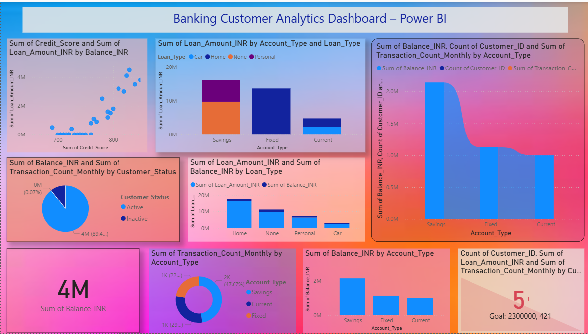

# Banking Customer Analytics Dashboard – Power BI

## Dashboard Preview

## Project Overview
This Power BI dashboard provides insights into banking customers, loan analysis, transactions and financial performance.
🚀 Excited to share my latest Power BI Project – Banking Customer Insights & Financial Analytics Dashboard

This dashboard provides deep insights into banking customers, including loan analysis, transaction behavior, account performance, and customer status. It helps in understanding customer trends and financial patterns for better decision-making.

🔹 Customer Segmentation & Status Analysis
🔹 Loan Amount & Credit Score Insights
🔹 Transaction & Account Type Performance
🔹 Balance and Financial Overview

Tools Used: Power BI | Data Visualization | Data Analytics

I’m continuously improving my skills in Data Analytics and Business Intelligence.
Feedback and suggestions are always welcome! 😊

#PowerBI #DataAnalytics #BankingAnalytics #DashboardDesign #DataAnalyst #BusinessIntelligence #LinkedInProjects

## Tools Used
Power BI | Data Analytics | Data Visualization
